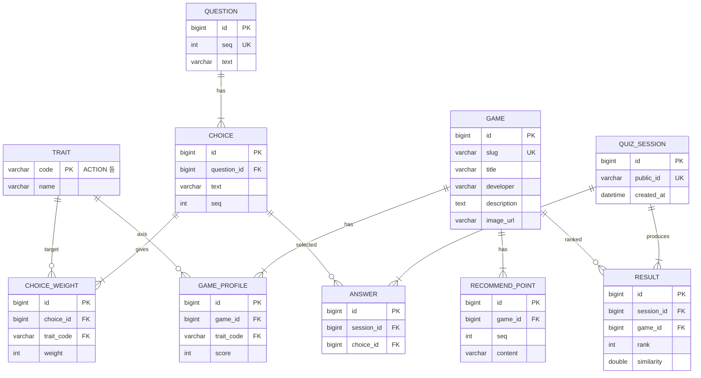

# 서브컬처 게임 추천 앱 – 데이터 설계

## 1. 추천 알고리즘
- 7개 성향 축: ACTION, STRATEGY, STORY, EXPLORE, CASUAL, DARK, CHAR
- 사용자가 고른 선택지의 `weights`를 축별로 합산 → 사용자 벡터
- 각 게임의 `profile`(0~10) 벡터와 **코사인 유사도** 계산 → 내림차순으로 Top N
- 음수 합계는 0으로 클램핑한 뒤 계산 (모든 값이 0이면 균등 벡터 사용)
- 데이터 파일: `data/questions.json`, `data/games.json` (DB 시드로도 사용)

## 2. ERD



유니크 제약: `CHOICE_WEIGHT(choice_id, trait_code)`, `GAME_PROFILE(game_id, trait_code)`, `ANSWER(session_id, choice_id)`.
세션은 비로그인 익명 방식이며 `public_id`(UUID)로 결과 공유 URL을 만든다.

## 3. JPA 엔티티 (Spring Boot 3 / Jakarta Persistence)

```java
@Entity @Getter @NoArgsConstructor(access = AccessLevel.PROTECTED)
public class Trait {
    @Id @Column(length = 20) private String code;
    @Column(nullable = false) private String name;
}

@Entity @Getter @NoArgsConstructor(access = AccessLevel.PROTECTED)
public class Question {
    @Id @GeneratedValue(strategy = GenerationType.IDENTITY) private Long id;
    @Column(nullable = false, unique = true) private int seq;
    @Column(nullable = false) private String text;
    @OneToMany(mappedBy = "question", cascade = CascadeType.ALL, orphanRemoval = true)
    @OrderBy("seq") private List<Choice> choices = new ArrayList<>();
}

@Entity @Getter @NoArgsConstructor(access = AccessLevel.PROTECTED)
public class Choice {
    @Id @GeneratedValue(strategy = GenerationType.IDENTITY) private Long id;
    @ManyToOne(fetch = FetchType.LAZY, optional = false) private Question question;
    @Column(nullable = false) private int seq;
    @Column(nullable = false) private String text;
    @OneToMany(mappedBy = "choice", cascade = CascadeType.ALL, orphanRemoval = true)
    private List<ChoiceWeight> weights = new ArrayList<>();
}

@Entity @Getter @NoArgsConstructor(access = AccessLevel.PROTECTED)
@Table(uniqueConstraints = @UniqueConstraint(columnNames = {"choice_id", "trait_code"}))
public class ChoiceWeight {
    @Id @GeneratedValue(strategy = GenerationType.IDENTITY) private Long id;
    @ManyToOne(fetch = FetchType.LAZY, optional = false) private Choice choice;
    @ManyToOne(fetch = FetchType.LAZY, optional = false) @JoinColumn(name = "trait_code") private Trait trait;
    @Column(nullable = false) private int weight; // 음수 허용
}

@Entity @Getter @NoArgsConstructor(access = AccessLevel.PROTECTED)
public class Game {
    @Id @GeneratedValue(strategy = GenerationType.IDENTITY) private Long id;
    @Column(nullable = false, unique = true) private String slug;
    @Column(nullable = false) private String title;
    private String developer;
    @Column(columnDefinition = "TEXT") private String description;
    private String imageUrl;
    @OneToMany(mappedBy = "game", cascade = CascadeType.ALL, orphanRemoval = true)
    private List<GameProfile> profile = new ArrayList<>();
    @OneToMany(mappedBy = "game", cascade = CascadeType.ALL, orphanRemoval = true)
    @OrderBy("seq") private List<RecommendPoint> recommendPoints = new ArrayList<>();
}

@Entity @Getter @NoArgsConstructor(access = AccessLevel.PROTECTED)
@Table(uniqueConstraints = @UniqueConstraint(columnNames = {"game_id", "trait_code"}))
public class GameProfile {
    @Id @GeneratedValue(strategy = GenerationType.IDENTITY) private Long id;
    @ManyToOne(fetch = FetchType.LAZY, optional = false) private Game game;
    @ManyToOne(fetch = FetchType.LAZY, optional = false) @JoinColumn(name = "trait_code") private Trait trait;
    @Column(nullable = false) private int score; // 0~10
}

@Entity @Getter @NoArgsConstructor(access = AccessLevel.PROTECTED)
public class RecommendPoint {
    @Id @GeneratedValue(strategy = GenerationType.IDENTITY) private Long id;
    @ManyToOne(fetch = FetchType.LAZY, optional = false) private Game game;
    @Column(nullable = false) private int seq;
    @Column(nullable = false) private String content;
}

@Entity @Getter @NoArgsConstructor(access = AccessLevel.PROTECTED)
public class QuizSession {
    @Id @GeneratedValue(strategy = GenerationType.IDENTITY) private Long id;
    @Column(nullable = false, unique = true, updatable = false) private String publicId = UUID.randomUUID().toString();
    @CreationTimestamp private LocalDateTime createdAt;
    @OneToMany(mappedBy = "session", cascade = CascadeType.ALL) private List<Answer> answers = new ArrayList<>();
    @OneToMany(mappedBy = "session", cascade = CascadeType.ALL) @OrderBy("rank") private List<Result> results = new ArrayList<>();
}

@Entity @Getter @NoArgsConstructor(access = AccessLevel.PROTECTED)
@Table(uniqueConstraints = @UniqueConstraint(columnNames = {"session_id", "choice_id"}))
public class Answer {
    @Id @GeneratedValue(strategy = GenerationType.IDENTITY) private Long id;
    @ManyToOne(fetch = FetchType.LAZY, optional = false) private QuizSession session;
    @ManyToOne(fetch = FetchType.LAZY, optional = false) private Choice choice;
}

@Entity @Getter @NoArgsConstructor(access = AccessLevel.PROTECTED)
public class Result {
    @Id @GeneratedValue(strategy = GenerationType.IDENTITY) private Long id;
    @ManyToOne(fetch = FetchType.LAZY, optional = false) private QuizSession session;
    @ManyToOne(fetch = FetchType.LAZY, optional = false) private Game game;
    @Column(name = "`rank`", nullable = false) private int rank; // rank는 일부 DB 예약어
    @Column(nullable = false) private double similarity;
}
```

구현 시 참고: 질문별 선택지 조회는 `@EntityGraph` 또는 fetch join으로 N+1을 피한다. `Result`의 `rank` 컬럼은 `ranking` 등으로 바꾸는 편이 안전하다.
